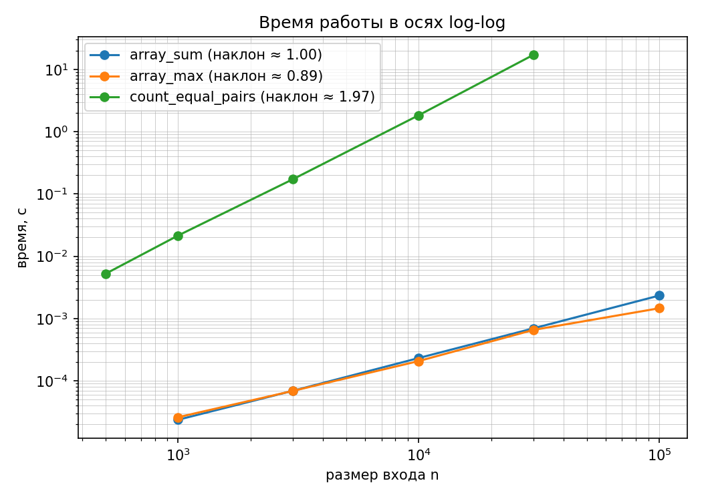
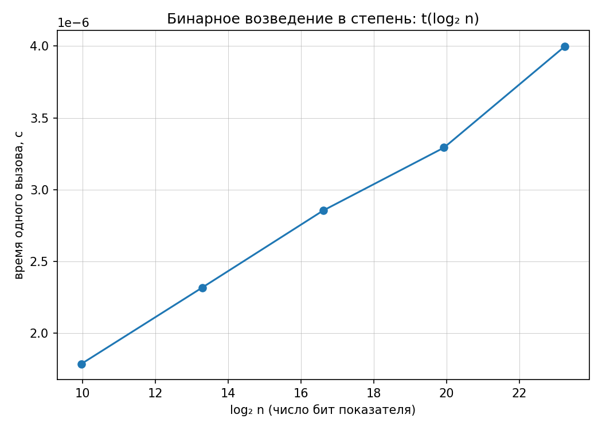

# Лабораторная работа №1: Анализ временной сложности
**Вариант:** 8

## 1. Аналитическая оценка сложности
1. **`array_sum`**: Θ(n). Один цикл по массиву из n элементов, внутри выполняется элементарная операция сложения за O(1). Итого: n * O(1) = Θ(n).
2. **`array_max`**: Θ(n). Аналогично, один проход по массиву с выполнением одного сравнения на итерацию.
3. **`count_equal_pairs`**: Θ(n²). Используются два вложенных цикла. Количество итераций внутреннего цикла образует арифметическую прогрессию: (n-1) + (n-2) + ... + 1 = n(n-1)/2. При отбрасывании констант и младших членов получаем Θ(n²).
4. **`binary_pow`**: Θ(log n). На каждой итерации цикла показатель степени `n` целочисленно делится на 2 (`n //= 2`). Количество шагов до достижения 0 равно ⌊log₂ n⌋ + 1. Внутри цикла выполняются только операции умножения и взятия остатка за O(1).

## 2. Экспериментальная проверка

### 2.1. Степенные алгоритмы (Log-Log график)

**Вывод:** 
- Для `array_sum` экспериментальный наклон составил **0.998**, что подтверждает теоретическую оценку **Θ(n)**.
- Для `array_max` экспериментальный наклон составил **0.895**, что подтверждает теоретическую оценку **Θ(n)**.
- Для `count_equal_pairs` наклон составил **1.965**, что с высокой точностью подтверждает оценку **Θ(n²)**.

### 2.2. Логарифмический алгоритм

**Вывод:** График зависимости времени от log₂ n является линейным, что подтверждает теоретическую оценку **Θ(log n)**.

## 3. Ответы на контрольные вопросы

**1. Почему для `binary_pow` выбраны линейные оси по log₂ n, а не log-log?**  
Если зависимость имеет вид t(n) = c · log n, то в log-log координатах мы откладываем log(t) от log(n). Математически это преобразуется в log(t) = log(c) + log(log n). Функция log(log n) растет чрезвычайно медленно и не является прямой линией (её наклон стремится к нулю). По такому графику практически невозможно достоверно определить порядок роста. Поэтому для логарифмических алгоритмов строят полулогарифмический график: t от log₂ n, где зависимость становится строго линейной.

**2. Почему замер `binary_pow` выполняется по модулю (`mod`)?**  
В Python целые числа имеют произвольную точность (длинная арифметика). Если возводить число в большую степень без модуля, результат будет содержать сотни тысяч цифр. Операция умножения таких гигантских чисел перестает быть элементарной операцией за O(1). Это полностью исказит эксперимент: вместо чистого алгоритмического Θ(log n) мы увидим рост, обусловленный внутренними накладными расходами Python на работу с большими числами. Операция по модулю ограничивает размер числа, сохраняя стоимость умножения константной O(1).

**3. Объяснение возможных расхождений теории и замеров:**  
Небольшие отклонения наклона от идеальных 1.0 или 2.0 объясняются:
- **Константными накладными расходами**: Асимптотика отбрасывает константы, но на малых n накладные расходы Python на вызов функций доминируют.
- **Иерархией памяти (Кэш)**: При больших n массив перестает помещаться в L1/L2 кэш процессора, что приводит к промахам кэша и замедлению доступа к памяти.
- **Фоновыми процессами ОС**: Несмотря на использование медианы из 5 повторов, фоновая активность системы может вносить микрошум в замеры.